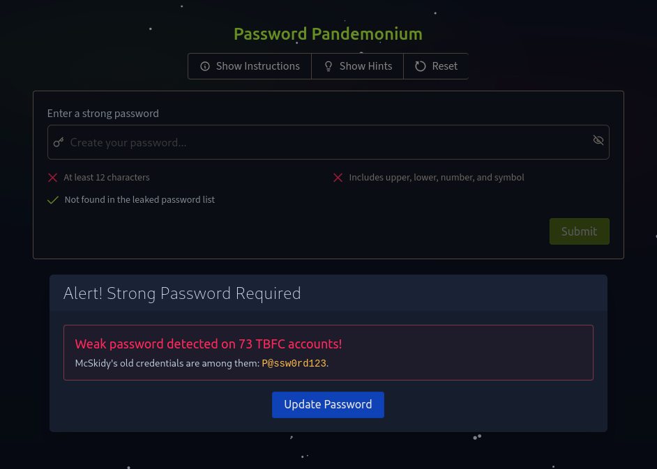
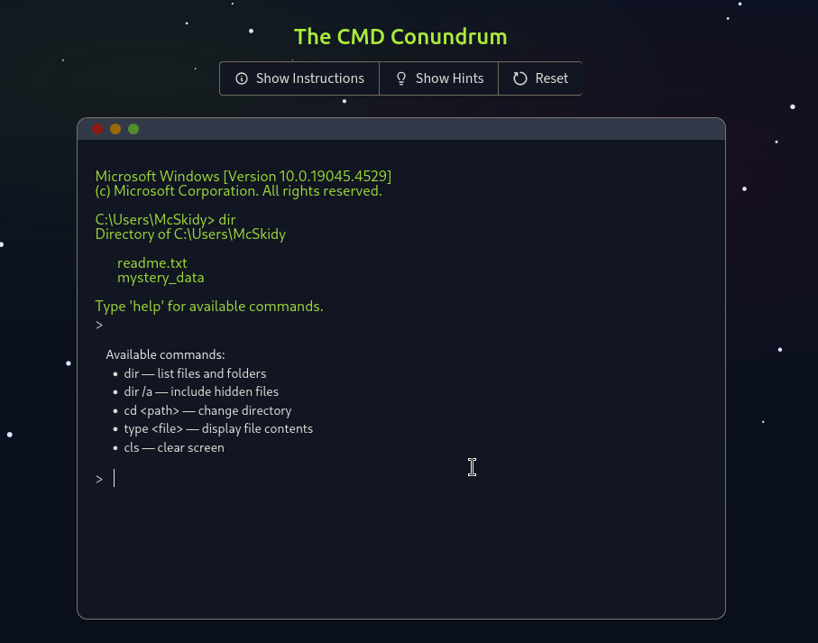
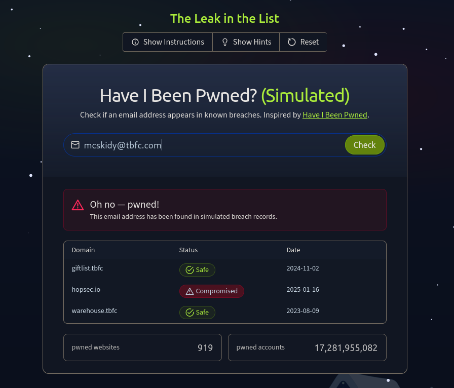
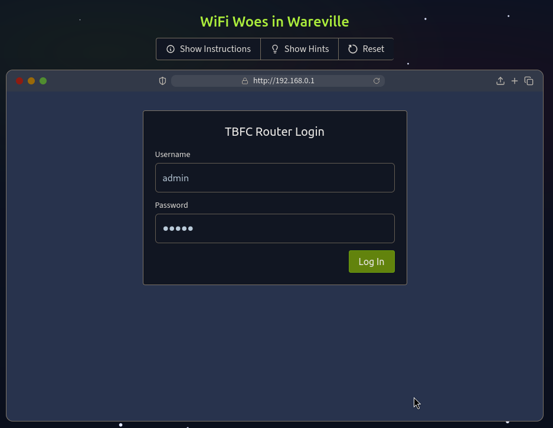
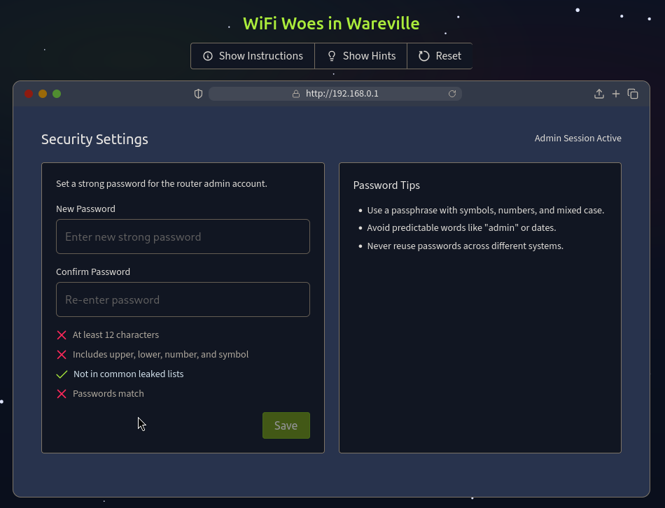
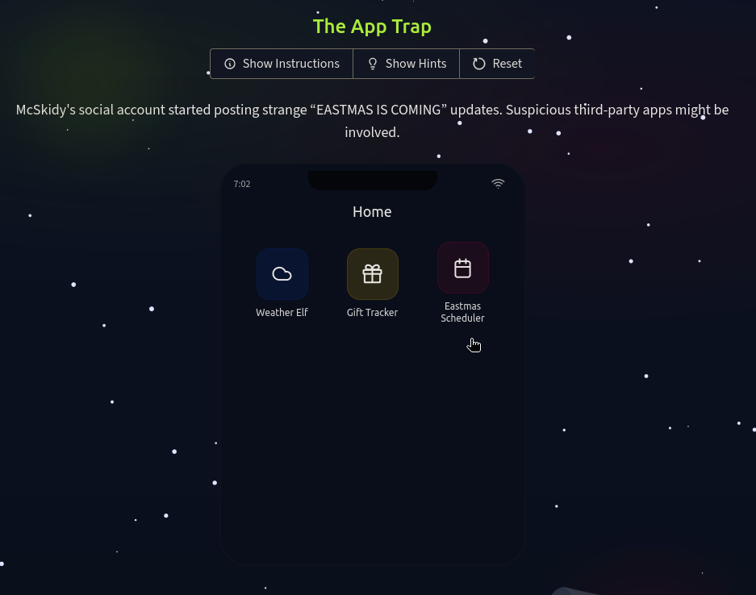
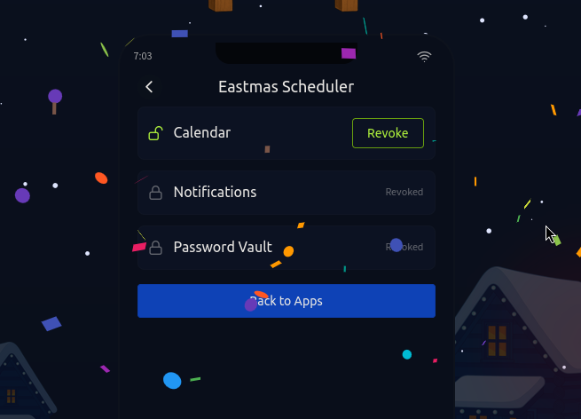

## What this is

This is the **Advent of Cyber 2025 Prep Track** write-up: ten bite-sized challenges meant to warm you up before the main AoC event.

If you’re brand new: this is “learn the basics and don’t set your laptop on fire.”
If you’re not new: this is “get reps in and tighten your habits.”

---

## Challenge 1 — Password Pandemonium

**Goal:** Update McSkidy’s password because `P@ssw0rd123` is a crime scene.

### What matters (not just what I clicked)
- **Length beats complexity.** Long passphrases are harder to brute-force than short “complex” passwords.
- **Uniqueness beats everything.** If the password is reused and shows up in a breach, it’s game over.

I went with a passphrase-style password: multiple words + a separator. Not magic, just practical.

**Takeaway:** Don’t “strong password” your way into a weak reused password. Use a password manager. Yes, really.

---

## Challenge 2 — The Suspicious Chocolate.exe

**Goal:** Don’t run mystery executables from mystery USB drives. (Wild concept.)

If you absolutely *must* inspect a suspicious file:
- Do it in a **quarantined VM**
- Use tools like **VirusTotal** (file reputation scanning)
- And remember: AV detections are signals, not proof… but “lots of detections” usually isn’t a coincidence.

**Reality check:** “I’ll just double click it to see what it does” is how you turn a normal day into an incident response tabletop.

**Takeaway:** Treat unknown USB + unknown EXE like it’s radioactive. Because it is.

---

## Challenge 3 — Welcome to the AttackBox!

**Goal:** Basic Linux navigation on TryHackMe’s AttackBox.

Key commands:
- `ls` — list files
- `cd` — change directory
- `pwd` — show current path
- `cat` — print file contents
- `clear` — clean your terminal (pure vibes)

**Takeaway:** If you can’t move around a shell comfortably, every other skill is going to feel 10x harder than it needs to be.

---

## Challenge 4 — The CMD Conundrum

**Goal:** Similar navigation, but in Windows Command Prompt.

`dir` is the Windows cousin of `ls`.  
Get help with:
- `dir /?`

**Takeaway:** Windows CLI isn’t scary. It’s just grumpy.

---

## Challenge 5 — Linux Lore

**Goal:** Find hidden files / messages.

The key move: `-a` to show hidden entries.

Example:
- `ls -a`

**Takeaway:** Hidden ≠ secure. It just means “not visible by default.”

---

## Challenge 6 — The Leak in the List

**Goal:** Check whether an email appears in known breaches.

The real-world tool you’ll hear about a lot:
- Have I Been Pwned (HIBP)

**Takeaway:** If your email shows up in breaches, the “fix” isn’t panic — it’s:
- change reused passwords
- turn on MFA
- stop reusing passwords (seriously)

---

## Challenge 7 — WiFi Woes in Wareville

**Goal:** Log into a router with default creds and secure it.

Default router passwords are basically an invitation.

Change the default password immediately.

**Takeaway:** Default creds are not “temporary.” They’re “until someone owns your network.”

---

## Challenge 8 — The App Trap

**Goal:** Find an app with permissions it shouldn’t have and revoke them.

The skill here is boring but real: **permission hygiene**.
If an app doesn’t need SMS access, it shouldn’t have SMS access.

**Takeaway:** Most “hacks” start with something stupid and preventable. This is one of those.

---

## Challenge 9 — The Chatbot Confession

**Goal:** Identify chatbot messages that leak sensitive info.

The best “AI security” strategy is still:
- don’t feed sensitive data into systems that don’t need it
- restrict access
- sanitize inputs/outputs
- log and monitor

**Takeaway:** If your LLM has access to secrets, assume it will eventually spill them. Plan accordingly.

---

## Challenge 10 — The Bunny’s Browser Trail

**Goal:** Spot the suspicious user agent in HTTP logs.

Most user agents look like:
- Firefox / Chrome / Edge + OS info

If you see something weird (like a made-up OS), it stands out.

**Takeaway:** Logs are where lies go to die. Learn to read them.

---

## What I actually learned

Let’s be honest: this track is **basic** — but it’s useful basic.

### Reps I’m taking into AoC
- move faster in Linux/Windows shells without thinking
- keep “unknown file” handling disciplined (VM + reputation + caution)
- default creds and permissions are low-effort, high-impact wins
- logs tell you what happened even when people don’t

### What I’m fixing in my own writeups (starting now)
- fewer “I clicked the thing” sentences
- more “why this matters in the real world”
- screenshots only when they add clarity (not as decoration)

If you’re reading this: go do the main Advent of Cyber. The prep track is warm-up — the real fun starts when things break.
