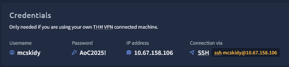
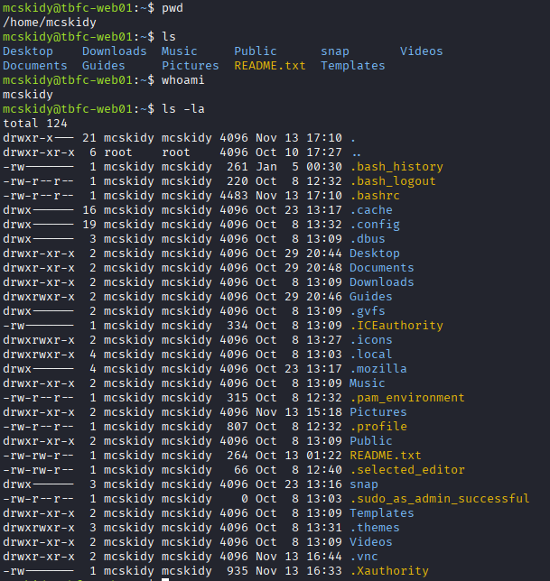
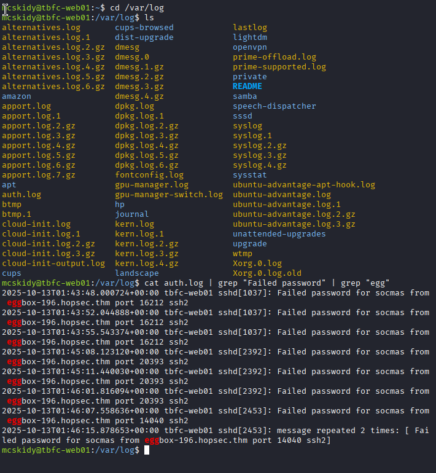
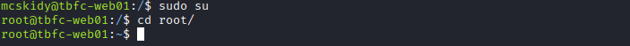
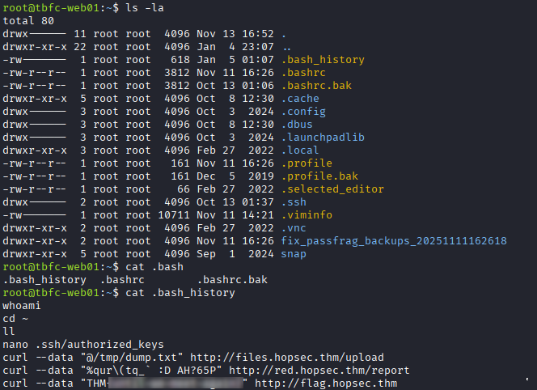

# Advent of Cyber 2025 – Day 01  

---
## TL;DR

This room serves as a fundamentals check for Linux command-line usage, covering file system navigation, basic log filtering, privilege context awareness, and artifact discovery. While it does not introduce new techniques, it reinforces baseline skills that are assumed knowledge in Linux familiarity. 

---

## Scenario / Objective

This challenge puts you in a **controlled Linux environment** designed to validate familiarity with basic command-line interaction. Rather than focusing on exploitation, the challenge acts as a fundamentals check: navigation, inspecting, filtering log data, and interacting with user privileges.

Primary objective is to locate specific artifacts by using common shell commands. Generally in the standard flag format of THM{example}.

Constraints are intentionally minimal. The environment assumes no prior system knowledge beyond standard Linux behavior and limits available tools to common built in commands.  

---

## What Actually Matters Here

Basic command-line interaction exists because nearly all meaningful system administration, incident response, and post-exploitation work on Linux systems happens through the shell. GUIs are often unavailable on servers, restricted in incident scenarios, or intentionally avoided to reduce the attack surfaces.

From a red team point of view, comfort with the CLI enables rapid reconnaissance after initial access. The ability to enumerate directories, search logs, escalate or confirm privileges context, and review command history allows attackers to understand what a system does, who has accessed it, and what actions have already been taken.

From a blue team point of view command-line activity is a primary telemetry source rather than background noise. Repeated directory enumeration, targeted log filtering, unexpected privilege elevation, and access to history files are all behaviors worth monitoring, especially when they occur outside normal administrative patterns. Not about blocking specific commands but more about recognizing **context, sequence, and intent** behind the shell's usage.

---

## Walkthrough 
Immediately upon opening the room and starting up the server we're given `Credentials` for logging in via `SSH` 



```bash
ssh mcskidy@10.67.158.106
```
### Step 1 – Orienting Within the System
When gaining access to a system enumeration or figuring out where you are or what you have access to is quite important. Commands such as: `pwd` `ls` `whoami` & `sudo -l`. Are all incredibly helpful, it is important to note that these are quite 'noisy' when it comes to Intrusion Detection Systems and other preventative measures.




### Step 2 – Filtering Relevant Log Data
Log files were to be examined to identify evidence of failed authentication attempts. Rather than manually scrolling through endless large files, targeted text filtering was used to isolate eateries of interest.


### Step 3 – Verifying Privilege Context

The challenge required confirming and switching privilege context to access protected information. This reinforces the importance of understanding **who you are on a system** before attempting privilege actions. 



### Step 4 – Artifact Discovery via Command History

Shell history was reviewed to uncover residual artifacts left by previous activity. Command history files often reveal sensitive information, missteps, or operational habits that can be leveraged by an attacker or investigated by a defender.



---

## Key Takeaways

- Technical: Basic Linux CLI usage enables rapid system orientaiton, artifact discovery, and log analysis without relying on GUIs or graphical tools.
- Security: Routine shell activity can reveal attacker reconnaissance or post-exploitation behavior when analyzed in context rather than as isolated commands.
- Practical: Even simple administrative actions leave artifacts, reinforcing the need to both monitor shell usage and practice a form of operational hygiene.
 
---

## Real-World Relevance

In real environments, Linux command-line activity is often the earliest and most reliable indicator of both legitimate administration and malicious behavior. Attackers who gain shell access rely on filesystem enumeration, log inspection, and privilege context checks to quickly understand the system they've compromised and decide their next move. 
