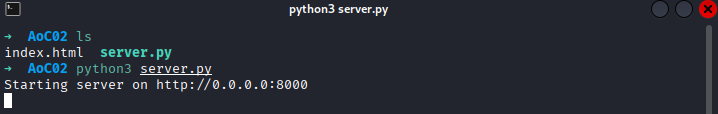
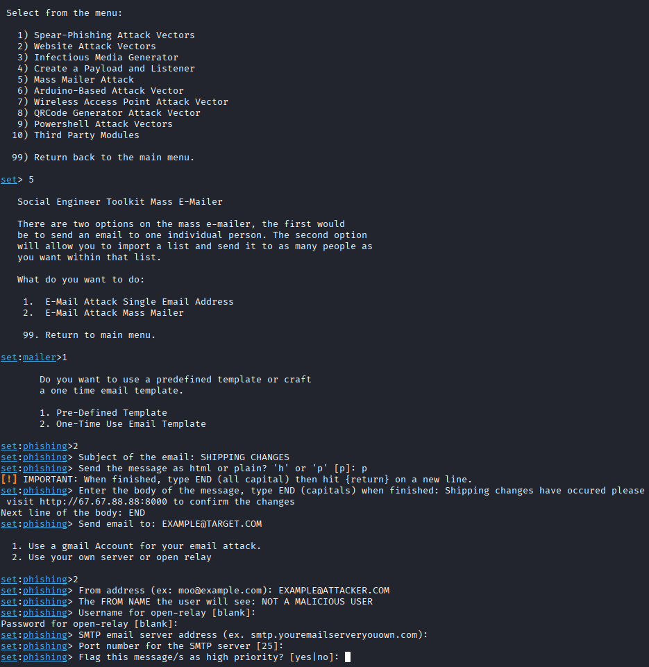

# Advent of Cyber 2025 — Day 02  

---
## TL;DR
This room focuses on crafting and exploiting an email phishing vector via Social-Engineer Toolkit to get 'SOCMAS employees' to click a specific link that has them sign into a fake login portal to harvest their credentials

---
## Scenario / Objective
Utilizing Social -Engineer Toolkit (SET) develop a convincing email that exploits a 'SOCMAS employee' into logging into the fake web server you're hosting on your machine. 
- Craft a convincing phishing email
- Host a web server to harvest credentials
- Utilizing the harvested credentials, sign into the actual portal and exflitrate information. 

---

## What Actually Matters Here
Phishing:
- **Phishing** is a very strong attack vector.
	>"Phishing remains nearly unsolvable – there's no patch for human gullibility"
- More than 90% of successful cyber-attacks are contributed to phishing. [source](https://www.cisa.gov/shields-guidance-families)
- In the case of defending or securing a company from this high risk vector includes a multitude of approaches.
	- SPF, DKIM, and DMARC
	- Domain & Link Control
	- Credential Protection
	- User Training
	- etc.

---

## Walkthrough

### Step 1 — Start Listening for Credentials
The rooms provides you with a prebuilt `.py` script to host the 'fake webpage' and harvests the credentials entered straight to the terminal you're running the script on.

### Step 2 — Social Engineering Toolkit (SET)
Crafting the payload/phishing email via the use of a prebuilt package called `Social-Engineering Toolkit (SET)` allows us to quickly create and send out a multitude of phishing emails without having to manually send them out.

---

## Key Takeaways
- **Technical:** Phishing campaigns can be rapidly deployed using readily available tooling like SET, combining email delivery with credential-harvesting infrastructure.
- **Security**: Even simple phishing setups can bypass perimeter defenses if users trust the message and authentication controls are weak or absent.
- **Practical**: Attack success often depend more on message plausibility and timing than on technical sophistication, reinforcing the need for layered defenses beyond email filtering, such as employee training.

---

## Real-World Relevance
This room mirrors one of the most common real-world initial access techniques used in modern attacks: credential harvesting through social engineering. Tools like the Social-Engineer Toolkit lower the barrier to entry, allowing attackers with minimal development skill to launch convincing phishing campaigns quickly.

In enterprise environments, phishing attacks like this frequently lead to compromised credentials that enable further access through VPNs, cloud portals, or internal applications. Once valid credentials are obtained, attackers often blend in with normal user activity, making detection significantly harder than traditional malware-based intrusions.

From a defensive standpoint, this reinforces the importance of identity-centric security controls such as MFA, strict email authentication policies (SPF, DKIM, DMARC), and rapid user reporting workflows. Organizations that rely solely on email filtering or user vigilance without credential protections remain highly vulnerable to this attack class.

---
