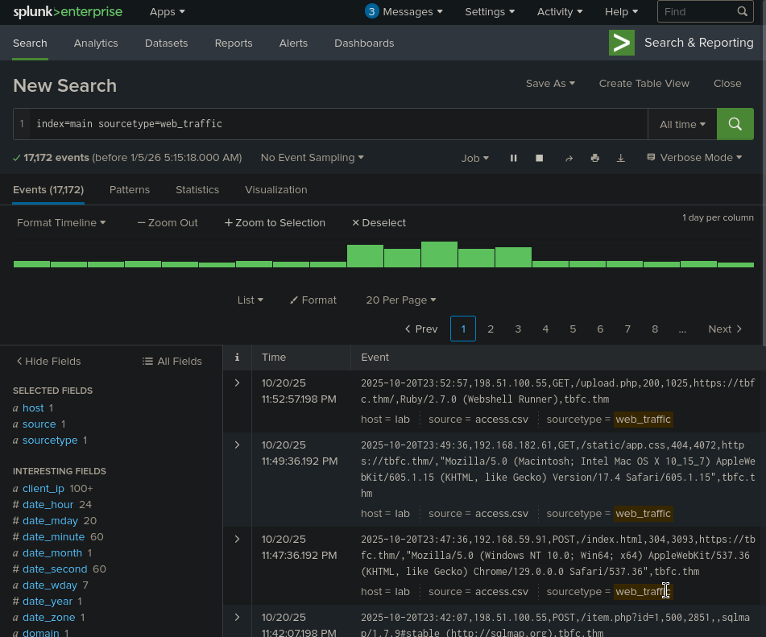
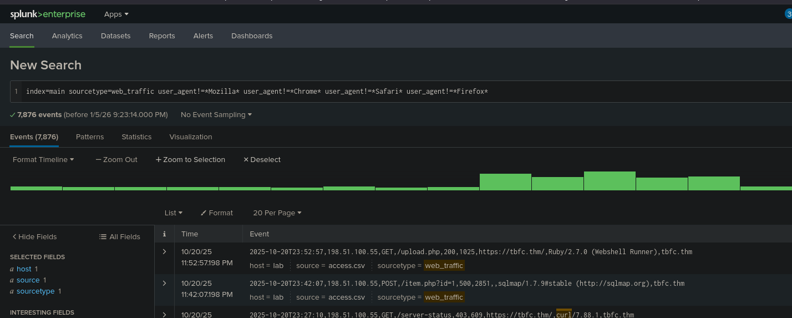
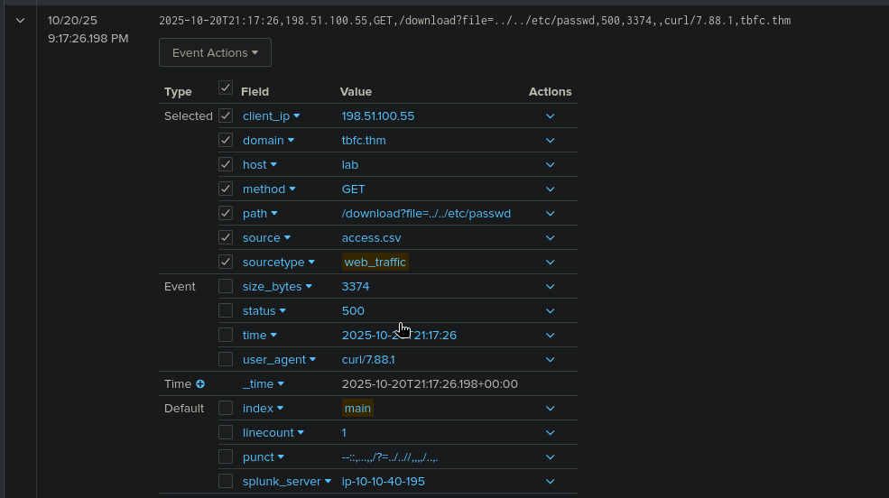

# Advent of Cyber 2025 — Day 03  

---
## TL;DR
This room introduces basic SIEM concepts using Splunk to search and filter log data for security-relevant events. It reinforces how centralized logging supports detection and investigation rather than teaching advanced query construction.

---

## Scenario / Objective
You’re dropped into a Splunk environment populated with indexed log data and asked to answer investigation-style questions by querying those logs. The objective is to identify relevant events by constructing simple searches and interpreting results correctly.

The environment is intentionally constrained: no complex SPL, no custom dashboards, and no external tooling. The focus is on understanding **how a SIEM is used**, not mastering Splunk syntax.

---

## What Actually Matters Here
SIEM platforms exist because raw logs are useless at scale without centralization, normalization, and searchability. Splunk allows defenders to aggregate logs from disparate sources and quickly pivot on indicators such as usernames, IP addresses, error messages, or timestamps.

Attackers rely on this same logging infrastructure—often unintentionally—by generating detectable patterns during reconnaissance, authentication abuse, or lateral movement. Failed logins, repeated access attempts, and anomalous activity sequences frequently surface first in SIEM data.

Defenders should focus less on individual log entries and more on **patterns over time**: repeated failures, unusual access sources, deviations from baseline behavior, and events occurring outside normal operational windows. Effective detection comes from asking the right questions of the data, not from memorizing search syntax.

---

## Walkthrough (High Signal Only)
Enough detail to be reproducible, not a screenplay.

### Step 1 — Establishing Search Context

Initial searches were used to confirm data availability and understand the structure of indexed logs. This step ensures that searches are scoped correctly before attempting to answer investigative questions.

### Step 2 — Filtering for Relevant Events

Targeted searches were used to isolate specific events of interest, such as authentication failures or user activity tied to the investigation questions. Filtering reduced noise and highlighted meaningful log entries.

> ⚠️ SIEM investigations fail more often due to poor scoping than missing data. Broad searches create noise; overly narrow searches miss context.
### Step 3 — Interpreting Results

The final step involved interpreting search results to extract answers rather than refining queries further. Understanding _what the logs imply_ mattered more than the mechanics of the search itself.
 

---

## Key Takeaways
- **Technical:** SIEM tools enable rapid querying and correlation of log data across systems.
- **Security:** Many attacker actions generate detectable log patterns even without malware.
- **Practical:** Effective log analysis depends on asking focused questions, not complex queries.

---

## Real-World Relevance
SIEM platforms like Splunk are central to modern blue team operations, supporting threat detection, incident response, and compliance monitoring. In real environments, analysts routinely use simple searches to triage alerts before escalating to deeper investigation.

Organizations that collect logs but fail to actively query and interpret them often miss early signs of compromise. This room reinforces that detection capability is driven by analyst intuition and investigation workflow as much as tooling sophistication.

---
